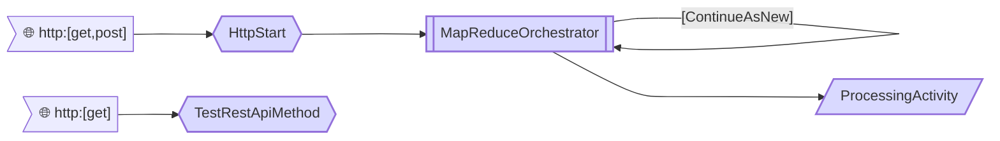

# repeating-map-reduce-sample

Demonstrates how to:
1. Implement map/reduce scenarios with [Azure Durable Functions](https://docs.microsoft.com/en-us/azure/azure-functions/durable/durable-functions-overview?tabs=csharp).
2. Run an [eternal orchestration](https://docs.microsoft.com/en-us/azure/azure-functions/durable/durable-functions-eternal-orchestrations?tabs=csharp), that perpetually restarts itself, passing some data that resulted from previous execution as input.

## How to run locally

* Clone this repo.
* In the project's folder create a `local.settings.json` file, which should look like this:

```
{
  "IsEncrypted": false,
  "Values": {
    "AzureWebJobsStorage": "your-azure-storage-connection-string",
    "FUNCTIONS_WORKER_RUNTIME": "dotnet"
  }
}
```

* Go to the project's folder with your command prompt and type the following:

```
func start
```

* Navigate to http://localhost:7071/api/HttpStart

This will start a singleton orchestration instance, which will proceed with executing some parallel activities, then sleep for a while and then restart itself. Invoking http://localhost:7071/api/HttpStart again will forcibly restart this orchestration (cancel all current execution history and start the process again).

Note, that because this is a *singleton* orchestration, there is no need to implement any periodic storage cleanup.

Also note this setting in [host.json](https://github.com/scale-tone/repeating-map-reduce-sample/blob/main/host.json) file:
```
    "extensions": {
        "durableTask": {
            "overridableExistingInstanceStates": 0
        }
    }    
```

This is essential for enabling the orchestration to be forcibly restarted (by default, `StartNewAsync()` method throws an exception if an instance with given id already exists).

Once up and running, you can monitor the orchestration's status with [Durable Functions Monitor](https://marketplace.visualstudio.com/items?itemName=DurableFunctionsMonitor.durablefunctionsmonitor):


## How to deploy to Azure

[](https://portal.azure.com/#create/Microsoft.Template/uri/https%3A%2F%2Fraw.githubusercontent.com%2Fscale-tone%2Frepeating-map-reduce-sample%2Fmain%2Farm-template.json)
